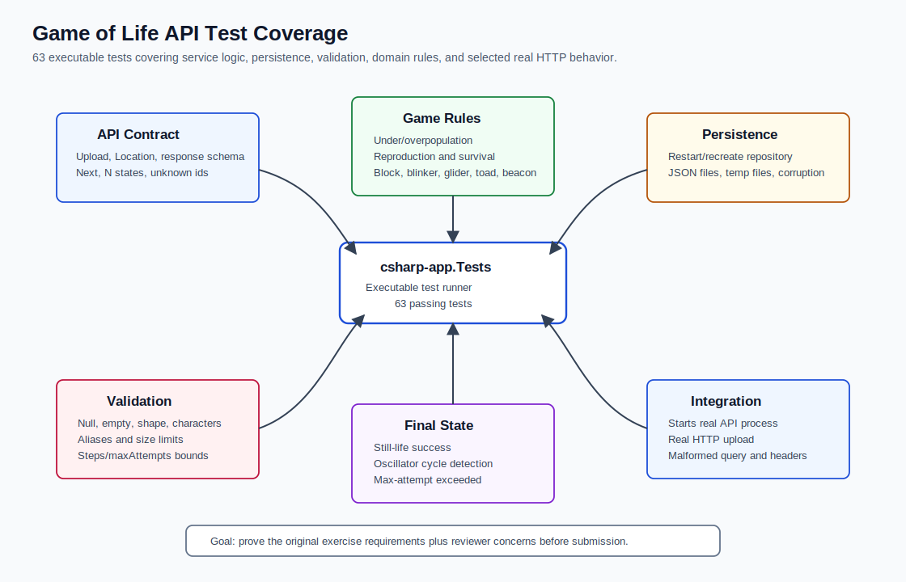

# Game of Life Test Suite

Executable test suite for the Conway's Game of Life API.

Run from the repository root:

```sh
dotnet run --project csharp-app.Tests
```

Some tests start the API process on temporary localhost ports, so they exercise both the application code and selected real HTTP behavior.

## Coverage Diagram



## What This Tests

The suite currently has 63 tests covering:

- Upload board returns id, normalized rows, `201 Created`, and `Location`.
- Stored boards can be retrieved after recreating the service/repository.
- Multiple boards persist independently.
- Persisted board files are valid JSON.
- Corrupted JSON board files are treated as not found.
- Temporary `.tmp` files are not exposed as boards.
- Core Conway rules: underpopulation, overpopulation, reproduction, and survival.
- Known patterns: block, blinker, glider, toad, beacon, and empty board.
- Finite-grid edge behavior, including single-cell, one-row, and one-column boards.
- N-state lookup, `states/0`, deterministic repeated reads, and non-mutating derived-state calls.
- Final-state behavior for still-life, delayed stabilization, oscillators, cycle detection, max-attempt exceeded, and zero attempts.
- Validation for null rows, empty rows, empty row strings, non-rectangular boards, invalid characters, aliases, negative values, and over-limit values.
- Board size limits and exact-limit acceptance.
- Large valid board one-generation computation.
- Unknown board id `404` behavior across endpoints.
- Real HTTP process checks for upload, malformed numeric query values, and malformed `Content-Length`.
- Basic concurrency checks for parallel uploads and reads.

## Structure

- `Program.cs`: custom executable test runner and all test cases.
- `RunningApi`: helper that starts the real API process on a temporary port for integration tests.
- `Assert`: lightweight assertion helpers.
- `docs/test-coverage.svg`: visual map of coverage areas.

## Design Choice

The test project intentionally avoids external test packages. That keeps the submission self-contained and runnable with only the installed .NET SDK. The tradeoff is less IDE/test-runner integration than xUnit, NUnit, or MSTest.
