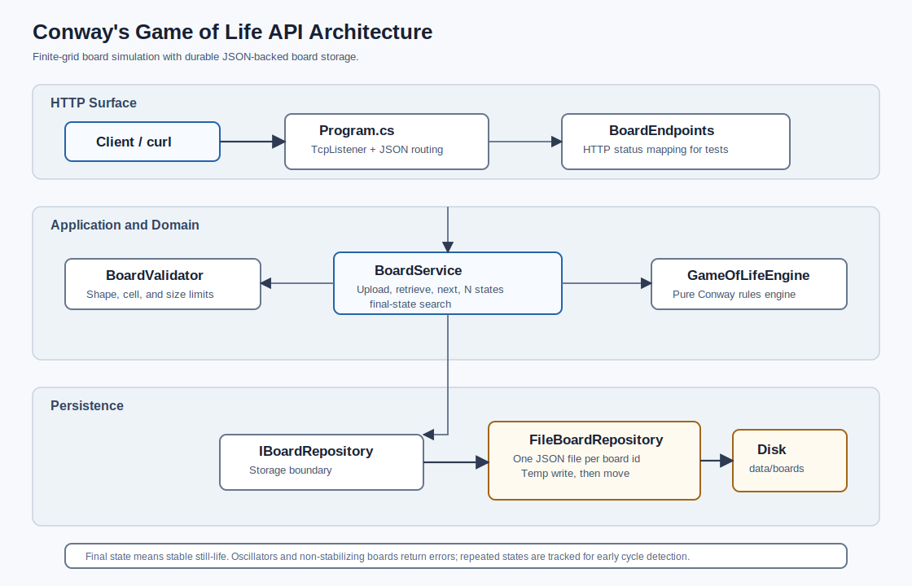

# Conway's Game of Life API

HTTP API for storing Conway's Game of Life boards and calculating future states.

The project targets `net10.0`, which is newer than .NET 7.0.

## Architecture Diagram



## Run

```sh
dotnet run --project csharp-app --urls http://127.0.0.1:5010
```

The default URL is:

```text
http://127.0.0.1:5010
```

You can also omit `--urls`; the service defaults to `http://127.0.0.1:5010`.

To use another port:

```sh
dotnet run --project csharp-app --urls http://127.0.0.1:5020
```

The service prints the active listener URL at startup:

```text
Game of Life API listening on http://127.0.0.1:5010/
```

## Test

```sh
dotnet run --project csharp-app.Tests
```

The test runner covers:

- Upload response id, `201 Created`, `Location`, and board response schema.
- Retrieval after service/repository restart.
- Multiple persisted boards remaining independent.
- Stored board files are valid JSON.
- Corrupted persisted JSON is treated as not found instead of crashing reads.
- Temporary `.tmp` persistence files are not visible as boards.
- Block still-life, blinker, empty board, glider, toad, and beacon patterns.
- Individual Conway rules: underpopulation, overpopulation, reproduction, and survival.
- Edge and corner finite-grid behavior.
- Single-cell, one-row, and one-column boards.
- `GET /states/0`, N-step retrieval, deterministic repeated reads, and non-mutating derived-state calls.
- Final-state success for still-life and delayed stabilization.
- Final-state errors for oscillator, cycle short-circuiting, zero attempts, and max-attempt exceeded.
- Validation for null rows, empty rows, empty row strings, non-rectangular boards, invalid characters, and alias normalization.
- Negative `steps` and negative `maxAttempts`.
- Server-side maximums for `steps` and `maxAttempts`.
- Exact board-size limits and one-over-limit failures for rows, columns, and total cells.
- Large valid board one-generation computation.
- High `steps` support and high `maxAttempts` cycle short-circuiting.
- Unknown board id `404` behavior for stored board, next state, N states, and final-state endpoints.
- Real HTTP process tests for upload, malformed numeric query values, and malformed `Content-Length`.
- Parallel uploads, parallel reads, unique ids, and no leftover temp files.

The executable suite currently has 63 tests. Some tests start the API process on temporary localhost ports to verify the real HTTP transport.

## Board Format

Boards are finite rectangular grids represented as rows of strings.

- `O` means alive
- `.` means dead

Accepted aliases on upload:

- Alive: `O`, `X`, `x`, `*`, `1`
- Dead: `.`, `0`

Uploaded boards are normalized back to `O` and `.`.

Size limits:

- Maximum rows: `2,000`
- Maximum columns: `2,000`
- Maximum total cells: `1,000,000`
- Maximum `steps`: `10,000`
- Maximum `maxAttempts`: `10,000`

Why these limits exist:

- Every generation is computed by scanning every cell, so runtime is `O(rows * columns)` per generation.
- `GET /states/{steps}` repeats that scan once per requested generation.
- `GET /final` may scan many generations and stores signatures for previously seen states to detect oscillators/cycles early.
- Uploaded boards are read into memory and persisted as JSON, so unbounded board sizes can create avoidable memory, CPU, and disk pressure.
- Separate row and column limits prevent extreme shapes, such as `1 x 1,000,000`, from creating very large strings or awkward memory behavior.
- The total-cell limit is the main work budget. A `1,000,000` cell board is large enough for meaningful patterns while keeping one-generation work predictable for this implementation.
- The `steps` and `maxAttempts` limits prevent a small board from still creating an unbounded CPU request.

Example:

```json
{
  "rows": [
    ".....",
    "..O..",
    "..O..",
    "..O..",
    "....."
  ]
}
```

## Endpoints

### Upload Board

`POST /boards`

Request:

```json
{
  "rows": [
    "....",
    ".OO.",
    ".OO.",
    "...."
  ]
}
```

Response: `201 Created`

```json
{
  "id": "0f3c6da1-6f8d-47e4-a38a-8a16014df91f",
  "rows": [
    "....",
    ".OO.",
    ".OO.",
    "...."
  ],
  "generation": 0
}
```

Invalid boards return `400 Bad Request`.

Example curl:

```sh
curl -X POST http://127.0.0.1:5010/boards \
  -H 'Content-Type: application/json' \
  -d '{"rows":[".....","..O..","..O..","..O..","....."]}'
```

### Get Stored Board

`GET /boards/{id}`

Returns the uploaded board at generation `0`.

Unknown ids return `404 Not Found`.

### Get Next State

`GET /boards/{id}/next`

Returns generation `1` computed from the originally uploaded board.

### Get N States Away

`GET /boards/{id}/states/{steps}`

Returns the board after `steps` generations from the originally uploaded board.

- `steps` must be `>= 0`
- `steps` must be `<= 10,000`
- Unknown ids return `404 Not Found`

### Get Final State

`GET /boards/{id}/final?maxAttempts=100`

Final state is interpreted as a stable still-life state: the next generation is identical to the current generation.

If the board enters an oscillator/cycle or does not stabilize within `maxAttempts`, the API returns `422 Unprocessable Entity` with an explanation. Repeated states are tracked so cycles are detected early.

- `maxAttempts` must be `>= 0`
- `maxAttempts` must be `<= 10,000`

Unknown ids return `404 Not Found`.

## Persistence

Boards are stored as JSON files using `FileBoardRepository`.

Default storage path:

```text
csharp-app/data/boards
```

Override with:

```sh
GAME_OF_LIFE_STORAGE=/some/durable/path dotnet run --project csharp-app
```

Persistence behavior:

- Each uploaded board is written to its own `{boardId}.json` file.
- Writes go through a temporary file and are then moved into place.
- Recreating the repository or restarting the process reloads boards from disk by id.
- Corrupted board JSON files are ignored and return not found for that id.
- Query endpoints compute derived states from the stored initial board and do not mutate the stored board.

## Architecture

- `Program.cs`: self-hosted HTTP listener, request routing, JSON serialization, and response mapping.
- `BoardEndpoints`: endpoint handler helpers used by tests for HTTP status behavior.
- `BoardService`: application service for upload, retrieval, N-step evolution, and final-state search.
- `GameOfLifeEngine`: pure Conway rules implementation.
- `BoardValidator`: input validation and normalization.
- `FileBoardRepository`: crash/restart-resilient file persistence.
- `csharp-app.Tests`: executable test suite with no external test package dependency.

## Limitations

- HTTP transport is intentionally minimal and supports the documented JSON endpoints only.
- The service binds one HTTP URL at a time.
- HTTPS, authentication, authorization, OpenAPI/Swagger, and browser UI are not implemented.
- Request bodies are read into memory; board upload limits protect the service from very large payloads.
- Board evolution is finite-grid only. Cells outside the uploaded rectangle are treated as dead.
- Each generation costs `O(rows * columns)`.
- Final-state detection stores seen board signatures, so memory usage grows with board size and attempted generations.
- The automated suite includes service, endpoint-handler, and selected real HTTP process tests. Additional raw HTTP cases can still be added when expanding the custom transport.

## Edge Cases

- Null, empty, non-rectangular, or invalid-character boards return validation errors.
- Boards over the row, column, or total-cell limits return validation errors.
- Empty boards remain empty.
- Finite board edges are treated as dead outside the uploaded grid.
- Negative or over-limit `steps`/`maxAttempts` return `400 Bad Request`.
- Oscillators return `422 Unprocessable Entity` instead of being mistaken for final states.

## Visual Examples

- [Big board browser animation](docs/big-board-animation.html)

Open the HTML file directly in a browser to see a 90 x 90 board evolve with gliders and oscillators. It is a standalone client-side visualization that uses the same finite-grid rules as the API.
